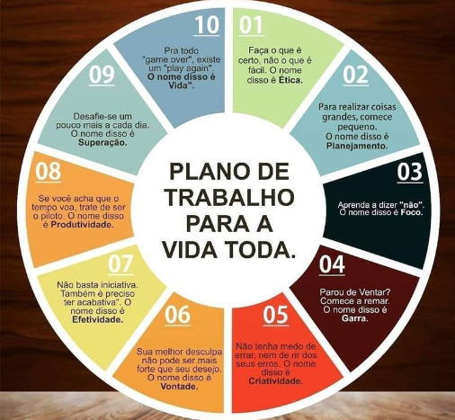

# Autodesenvolvimento 2

Nada é tão bom que não possa ser melhorado. Evolua...respeitando sua saúde e o seu tempo.

Coloco-me à disposição para o que for necessário 

[Linkedin](https://www.linkedin.com/in/mirian-ajiki-molicawa-a770902b/)

# Skillsoft Compliance Solutions   
[Skillsoft](https://www.skillsoft.com/)

| Data           	| Certificado 	| Curso                                                                                        	| Carga Horária 	|
|----------------	|-------------	|----------------------------------------------------------------------------------------------	|---------------	|
| 16/02/2021	    | 26039543 	    |Curso de Capacitação de Ergonomia                                                             	| 2 horas        	|
| 09/03/2021	    | 27225177	    |Code of Ethics and Business Conduct Awareness Training & Certification                        	| 2 horas        	|
| 29/03/2021 		  | 5284107       |Taking Security Home: Working Remotely				                        	                        | 2 horas        	|
| 29/03/2021 		  | 5391345	      |Information Security Policy - All Associates			                        	                    | 2 horas        	|
| 19/05/2021		  | 28234580 	    |Social Engineering Awareness for Service Desk Agents		                                      	| 2 horas        	|
| 21/05/2021		  | 28550900 	    |Respectful Workplace 2021 					                        	                                  | 1 hora        	|
| 02/07/2021		  | 29390338 	    |Records Management and Security Sensitivity Classification 					                          | 2 horas        	|
| 23/06/2021		  | 5654650	      |KnowBe4 Social Engineering Red Flags 							                                          	| 1 hora        	|
| 09/07/2021		  | 31013594 	    |Data Privacy Training 									                                                      	| 2 horas        	|

# TI Exames
[TI Exames](https://tiexames.com.br/novosite2015/index.php)

| Data           	| Certificado 	| Curso                                                                                        	| Carga Horária 	|
|----------------	|-------------	|----------------------------------------------------------------------------------------------	|---------------	|
| 28/10/2021	   	| 569770 	      |Formação Inicial em Privacidade + LGPD (Preparatório EXIN PDPE)                    	 	        | 6 horas        	|
| 10 e 11/11/2021	| 709784	      |Privacidade Muito Além da LGPD - Tendências e Oportunidades		                     	          | 3 horas        	|
| 15/11/2021 		  | 711582	      |Regulamento do Proc. de Fiscalização e do Proc. Admin. Sancionador no âmbito da ANPD		        | 2 horas        	|
| 22/11/2021	  	| 712615	      |Engenharia Social: Técnicas de Persuasão para invasão de Privacidade (LGPD)	               	  | 2 horas        	|
| 11/12/2021		  | 		          |Expo LGPD 2021 ANPPD Associação Nacionado dos Profissionais de Privacidade de Dados           	| 7 horas        	|
| 13/12/2021		  | 727180	      |ISO/IEC 27032 para DPOs – Padrão de Segurança Cibernética		                     	            | 2,5 horas      	|
| 12 e 13/01/2022 | 805017	      |Adequação à LGPD adotando o Sistema de Gestão de Proteção de Dados (SGPD)                     	| 4 horas        	|
| 29/09/2022  |1751933	|Importância dos Controles ISO/IEC27001:2022 na Governança de Privacidade desde a Concepção e por Padrão 	| 1.5 horas      	|

# PSG Tecnologia Aplicada
[PSG](http://psgtecnologia.com.br/)
| Data           	      | Certificado 	| Curso                                                                                  	| Carga Horária 	|
|---------------------- |-------------	|----------------------------------------------------------------------------------------	|---------------	|
| 17/01/22 a 11/02/2022 | 		          |Curso de Natural Básico com Adabas				                  	                          	| 40 horas      	|
| 14/02/22 a 15/03/2022 | 		          |Curso de Natural Avançado com Adabas				                  	                         	| 44 horas       	|

# Escola Conquer
[Conquer](https://escolaconquer.com.br/)
| Data           	| Certificado 	| Curso                                                                                        	| Carga Horária 	|
|----------------	|-------------	|----------------------------------------------------------------------------------------------	|---------------	|
| 19/07/2022 	  	| 		          |PNL para Líderes						                  	                                              	| 4 horas        	|
| 20/07/2022		  | 		          |A Linguagem dos Bancos de Dados						                                                	 	| 10 horas       	|
| 23/07/2022		  | 	            |Ciência de Dados						      	 			                                                      | 4 horas        	|

# Gino Terentim Academia De Desenvolvimento Empresarial LTDA
[Gino Terentim](https://www.ginoterentim.com/)
| Data           	       | Certificado 	               | Curso                                                                    | Carga Horária 	|
|---------------------   |--------------------------   |------------------------------------------------------------------------  |---------------	|
|20, 21, 26 e 27/07/2022 |GT-PSMPSPO-T001-2022-9650230 |Fundamentos Scrum e Preparatório PSM I e PSPO I 					                | 15 horas        |

# DATAB
[DataB](https://datab.com.br/)
| Data           	       | Certificado 	               | Curso                                                                     | Carga Horária 	 |
|---------------------   |--------------------------   |------------------------------------------------------------------------   |---------------	 |
|16/08/2022              |62890dbcf81a08db8e048326     |Minicurso Básico de Power BI                        			                 | 1 hora          |
|01/09/2022              |6303dee42c2b91e4de01c78d     |Semana do Power BI                        			                           | 8 horas         |

# Canal Valor
[Canal Valor](https://canalvalor.com/)
| Data           	| Certificado 	                                        | Curso                                                	| Carga Horária 	|
|----------------	|----------------------------------------------------- 	|------------------------------------------------------	|---------------	|
| 23/12/2022 	  	| A9d6deffa69dd70dc545b849ae0764125a5f3fdc/12860409/1   |Fundamentos de Gestão de Backlog              	        | 4 horas        	|
| 25/12/2022 	  	| D66619ad2500a07098035633de073c05f8c125ae/12860409/1   |Jira e Confluence                            	        | 14 horas      	|
| 28/12/2022 	  	| 417698a3dd543fbc71be46704fce2a48ebd19c19/12860409/1   |Fundamentos do Método Kanban                  	        | 3 horas       	|

